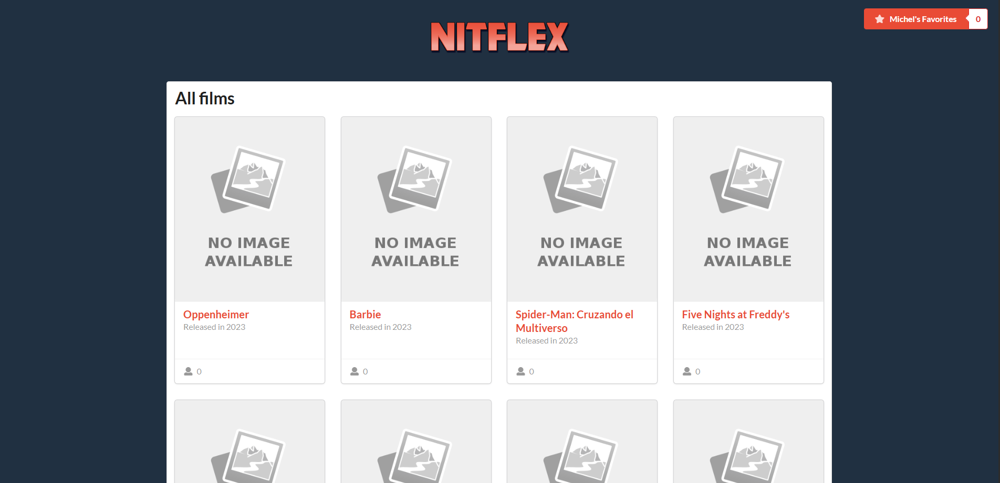
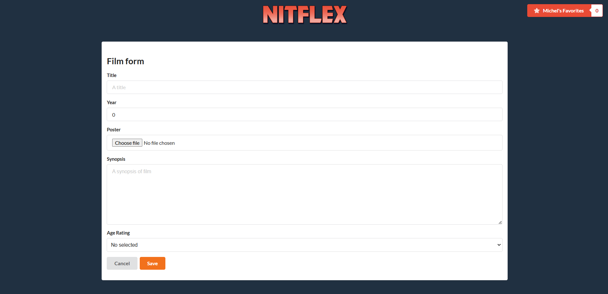
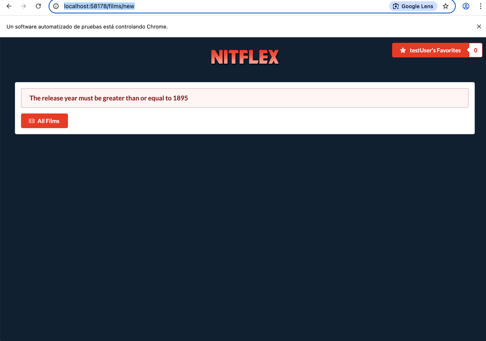

# Práctica Calidad Software - Grupo 7

# Miembros del grupo
| Nombre y apellidos | Email urjc | Nickname GitHub |
|:-----------------|:-----:|-------:|
| **Olga Chubinova Bortsova**    | o.chubinova.2022@alumnos.urjc.es | chubi0l |
| **Elinee Freites**    | en.freites.2022@alumnos.urjc.es | ElineeF |
| **Andrea Garrobo Guzmán**    | a.garrobo.2022@alumnos.urjc.es | Garrobo08 |
| **Jordi Guix Betancor**    | j.guix.2023@alumnos.urjc.es | jordigb44 |

# 🔗 Github Repository URL 
https://github.com/Jordigb44/calidad-software-2025-grupo-7

# 🔗 Azure Production URL
**Production:** http://nitflex-production.spaincentral.azurecontainer.io:8080
**Staging** http://nitflex-staging.spaincentral.azurecontainer.io:8080

- ☁️ Contenedor en Azure Nitflex Production Version 1.1.2: [`nitflex-production.spaincentral.azurecontainer.io:8080`](http://nitflex-production.spaincentral.azurecontainer.io:8080/)
  - Imagen del portal de azure: [Portal Azure](https://github.com/Jordigb44/calidad-software-2025-grupo-7/blob/main/captures/azure_portal_nitflex_production_1_1_2.png)
  - Imagen de la aplicación: [Nitflex production 1.1.2](https://github.com/Jordigb44/calidad-software-2025-grupo-7/blob/main/captures/nitflex_production_1_1_2.png)

- ☁️ Contenedor en Azure Nitflex Staging: [`nitflex-staging.spaincentral.azurecontainer.io:8080`](http://nitflex-staging.spaincentral.azurecontainer.io:8080/)

## 🖥️ Screenshots
**Azure Portal** 
**Nitflex-staging** https://github.com/Jordigb44/calidad-software-2025-grupo-7/blob/main/captures/nitflex_production_1_1_2.png

# Practise 1
## Olga Chubinova Bortsova
| Commit | Description |
| :----: | :---------: |
| [Link](https://github.com/Jordigb44/calidad-software-2025-grupo-7/commit/3e2a27ec50f6b3e2d26b0e7de6682be611e268f3) | Task 1 (Test Unitario) |
| [Link](https://github.com/Jordigb44/calidad-software-2025-grupo-7/commit/2e0db2f91bc79ae81d9f9a14c2b4bce2573f8f8f) | Task 2 (Test de Integración con BBDD) |
| [Link](https://github.com/Jordigb44/calidad-software-2025-grupo-7/commit/32d73e8df0a5648f16f3258ca3f65c101027aa11) | Task 3 (Test de sistemas web - Selenium) |
| [Link](https://github.com/Jordigb44/calidad-software-2025-grupo-7/commit/699e5f397d67ed7f3564f4c3cf5c5fa62923b90e) | Task 4 (Test de sistemas Rest) |
| [Link](https://github.com/Jordigb44/calidad-software-2025-grupo-7/commit/173509a46e60b805e0cac953f8ccfa67cf0f1183) | Artillery Test | 
| [Link](https://github.com/Jordigb44/calidad-software-2025-grupo-7/commit/ffc8b3d180b915db0f5df23d8d262ce2e9ab02dd) | Cobertura Jacoco |


## Jordi Guix Betancor
| Commit | Description |
| :----: | :---------: |
| [Link](https://github.com/Jordigb44/calidad-software-2025-grupo-7/commit/9d0b562343c25d3fc28510d0c53e1421e060d88e) | Task 2 (Test Unitario) |
| [Link](https://github.com/Jordigb44/calidad-software-2025-grupo-7/commit/c5111c44b52609500c805e5c2011185ba06e72ba) | Task 3 (Test de Integración con BBDD) |
| [Link](https://github.com/Jordigb44/calidad-software-2025-grupo-7/commit/93c66c3c998597beb8c929101113c8a2f38b5c02) | Task 4 (Test de sistemas web - Selenium) |
| [Link](https://github.com/Jordigb44/calidad-software-2025-grupo-7/commit/8385d76cf56c417ae3491401a8cdda3c9fd5b35d) | Task 1 (Test de sistemas Rest) |
| [Link](https://github.com/Jordigb44/calidad-software-2025-grupo-7/commit/c56167eafc2af5cb146dc0b7a5ca416099b9d5b2) | Artillery Test |


## Elinee Nathalie freites Muñoz
| Commit | Description |
| :----: | :---------: |
| [Link](https://github.com/Jordigb44/calidad-software-2025-grupo-7/commit/d02c718f579ca7fb7334026434a3a0699ec909d2) | Task 4 Ttest Unitario |
| [Link](https://github.com/Jordigb44/calidad-software-2025-grupo-7/commit/d02c718f579ca7fb7334026434a3a0699ec909d2) | Task 1 (Test de Integración con BBDD) |
| [Link](https://github.com/Jordigb44/calidad-software-2025-grupo-7/commit/9c167b09bd6799bc8a6116c03d8233fbda1458f2) | Task 2 (Test de sistemas web - Selenium) |
| [Link](https://github.com/Jordigb44/calidad-software-2025-grupo-7/commit/ed49dc75f653b9581d2e726d446a50de4a569a52) | Task 3 (Test de sistemas Rest) |
| [Link](https://github.com/Jordigb44/calidad-software-2025-grupo-7/commit/08112a0fe91c256cc689d05092f377fc94ec1254) | Artillery Test |
| [Link](https://github.com/Jordigb44/calidad-software-2025-grupo-7/commit/ffc8b3d180b915db0f5df23d8d262ce2e9ab02dd) | Cobertura Jacoco |

## Andrea Garrobo Guzmán
| Commit | Description |
| :----: | :---------: |
| [Link](https://github.com/Jordigb44/calidad-software-2025-grupo-7/commit/890668abfe9d13d21e79e9cad564e2a55a721b85) | Task 3 - Test Unit |
| [Link](https://github.com/Jordigb44/calidad-software-2025-grupo-7/commit/5747d956b66760d1c5b4bb4aa71b5691cf753600) | Task 4 - Test Integration |
| [Link](https://github.com/Jordigb44/calidad-software-2025-grupo-7/commit/c438b79a41a8b54aa19f814adb34b3e4770983ae) | Task 1 - Selenium Web Test |
| [Link](https://github.com/Jordigb44/calidad-software-2025-grupo-7/commit/ac2a3b51c9cad6a2cf9206b64af91dd894af59d2) | Task 2 - Test  rest |
| [Link](https://github.com/Jordigb44/calidad-software-2025-grupo-7/commit/08112a0fe91c256cc689d05092f377fc94ec1254) | Artillery Test |
| [Link](https://github.com/Jordigb44/calidad-software-2025-grupo-7/commit/ffc8b3d180b915db0f5df23d8d262ce2e9ab02dd) | Cobertura Jacoco |


# Practise 2
## 👥 Task Assignment
The following outlines the contribution of each team member to the project:
- **[Olga Chubinova Bortsova]**
  - Actively contributed to the implementation and configuration of the **four GitHub Actions workflows**:
  - Also implemented the Smoke Test and the Selenium Test for the multibrowser
  - Responsible for **fix-1**, which involved:
    - Fixing the malfunction of the **"Cancel"** button on the "Create New Movie" page (it was not returning to the "All Movies" page).
    - Adding a **regression test using Selenium** to verify that users can successfully navigate back to the list of all movies.
    - Simulating the development and maintenance of the Nitflex application using the **existing CI workflows** and following the **GitHub Flow** development model.
  - Fully organized and wrote the **project readme**.

- **[Jordi Guix Betancor]**
  - Actively contributed to the implementation and configuration of the **four GitHub Actions workflows**
  - Responsible for **feature-1**, which involved:
    - Implementing validation for movie release year (must be >= 1895)
    - Adding error handling and user notification when invalid year is entered
    - Creating unit tests to verify year validation logic
    - Implementing Selenium E2E tests to ensure proper error display
    - Following the GitHub Flow model for feature development
    - Ensuring proper error messages display in the frontend
  - The implementation included:
    - Adding validation in FilmService
    - Creating comprehensive test coverage
    - Handling error display in the web interface
    - Maintaining consistency across the application

- **[Elinee Nathalie freites Muñoz]**
  - I have collaborated in workflows 1, 2, and 3. Additionally, I was responsible for refactoring task 1, which consisted of using SonarQube locally to identify code smells.
    - Following the guidelines provided by the tool, I corrected each detected code smell, making a separate commit for each correction in the corresponding branch.
    - Info-level code smells were ignored.
    - In the pull request, I documented which code smells were not fixed because they were considered false positives.

- **[Andrea Garrobo Guzmán]**
  - I was responsible for fix task 2.
    - It was detected that the DatabaseInitializer was not using the correct method to load images, which caused the sample movies to appear without a photo when deployed on Azure, as it attempted to load images       from the local file system.
    - To resolve this issue, I modified the class to load images from a URL instead, using the methods provided by ImageUtils.

## 🔄 Steps Followed
The following outlines the steps followed to apply the fix for the Cancel button issue and deploy it using GitHub Flow and CI/CD pipelines.

- **[STEP 1 - Olga Chubinova Bortsova]**
### 🛠️ Fix Implemented
- In the movie creation template (`filmForm.html`), the Cancel button originally redirected to a non-functional path:
  ```html
  <button class="ui button" onclick="location.href='/films/{{film.id}}'; return false;">Cancel</button>
  ```
- This was changed to:
  ```html
  <button class="ui button" onclick="location.href='/'; return false;">Cancel</button>
  ```
  This update ensures the Cancel button correctly redirects users back to the **home page**, where the list of films is displayed.

- A **Selenium regression test** was added to an existing test class to verify this behavior:
  ```java
  @Test
  @DisplayName("Cancel button from new film page navigates back to film list")
  void testCancelFromNewFilmForm() {
      driver.get("http://localhost:" + port + "/films/new");

      WebElement cancelButton = wait.until(ExpectedConditions.elementToBeClickable(By.xpath("//button[text()='Cancel']")));
      cancelButton.click();

      wait.until(ExpectedConditions.urlToBe("http://localhost:" + port + "/"));
      WebElement createButton = wait.until(ExpectedConditions.presenceOfElementLocated(By.id("create-film")));

      assertTrue(createButton.isDisplayed(), "Expected to be on the homepage after canceling, but we are not.");
  }
  ```
### 🔧 Git Commands Used
The following Git commands were used throughout the development and deployment of the fix:
```bash
# Create a new branch (This branch was created in the beggining of the proyect)
git checkout -b fix-1
# Stage and commit the changes
git add .
git commit -m "cancel button in new film form fixed"
# Push the branch to GitHub
git push origin fix-1
```
A pull request was opened on GitHub from `fix-1` to `main`, reviewed, and approved. After approval, the branch was succesfully merged.
```bash
# Switch to the main branch
git checkout main
# Merge the fix branch
git merge fix-1
# Push the updated main branch to GitHub
git push origin main
```
### ⚙️ Triggered Workflows
Once merged into `main`, the following workflows were automatically triggered by GitHub Actions:
- ✅ [Workflow 2](https://github.com/Jordigb44/calidad-software-2025-grupo-7/actions/runs/15252109117)
- ✅ [Workflow 3](https://github.com/Jordigb44/calidad-software-2025-grupo-7/actions/runs/15252259279)
- ✅ [Workflow 4](https://github.com/Jordigb44/calidad-software-2025-grupo-7/actions/runs/15252613498)

### 🐳 Docker Image
The Docker image built during this process is published on Docker Hub with the corresponding tag was deleted because the Workflow (before) always deleted the image but we can found the command in the action:
- [chubi0l/nitflex:1.0.1(workflow3)](mvn spring-boot:build-image -DskipTests -Dspring-boot.build-image.imageName=***/nitflex:f1295070b0a260e5a510307cd92fda39682c1bcc)
- [chubi0l/nitflex:1.0.1(workflow4)](mvn spring-boot:build-image -DskipTests -Dspring-boot.build-image.imageName=***/nitflex:f1295070b0a260e5a510307cd92fda39682c1bcc)

### 🌍 Staging Deployment
Before it appeared a error screen because it didn't found the id of the film (because it wasn't created yet, so now it redirects directly to the main page)



- **[STEP 2 - Jordi Guix Betancor]**
#### 🛠️ Feature Implemented (feature-1)
- Added year validation in `FilmService.java`:
  ```java
  public FilmDTO save(CreateFilmRequest film, Blob imageField) {
      if (film.releaseYear() < 1895) {
          throw new IllegalArgumentException("The release year must be greater than or equal to 1895");
      }
      // ...existing code...
  }
  ```

- Added unit test to verify the validation:
  ```java
  @Test
  @DisplayName("Cuando se guarda una película con un año anterior a 1895, NO se guarda en el repositorio y se lanza una excepción")
  void testSaveFilmWithInvalidYear() {
      //GIVEN
      CreateFilmRequest invalidFilm = new CreateFilmRequest(
          "Película antigua", 
          "Una película muy antigua", 
          1894,  // Año inválido
          "+12"
      );

      //WHEN & THEN
      assertThrows(IllegalArgumentException.class, () -> {
          filmService.save(invalidFilm);
      }, "The release year must be greater than or equal to 1895");

      verify(filmRepository, never()).save(any(Film.class));
  }
  ```

- Added Selenium E2E test to verify error display:
  ```java
  @Test
  @DisplayName("Cuando se intenta crear una película con año anterior a 1895, se muestra error y no se crea la película")
  void testAddFilmWithInvalidYear() {
      // ...setup code...
      addFilm("Película Test Año Inválido", FILM_DESCRIPTION, "1894", "+12", null);
      
      WebElement errorMessage = wait.until(ExpectedConditions.presenceOfElementLocated(By.id("message")));
      assertEquals("The release year must be greater than or equal to 1895", 
          errorMessage.getText().trim());
  }
  ```

- Modified error handling in `FilmWebController.java`:
  ```java
  @PostMapping("/films/new")
  public String newFilmProcess(CreateFilmRequest film, MultipartFile imageField, Model model) {
      FilmDTO newFilm = null;
      try {
          newFilm = filmService.save(film, imageField);
      } catch(IllegalArgumentException e) {
          model.addAttribute("error", true);
          model.addAttribute("message", e.getMessage());
          return "error";
      }
      return "redirect:/films/" + newFilm.id();
  }
  ```

#### 🔧 Git Commands Used
```bash
# Create feature branch
git checkout -b feature-1

# Stage and commit changes
git add .
git commit -m "feat: add validation for movie release year (>= 1895)"

# Push to GitHub
git push origin feature-1
```
Note: During the push, I did a ```git revert 5ab7daf``` since my first push hadn't selected the feature-1 branch, so it was pushed to the main branch. To fix the error, I had to run that command to restore the main branch to its previous state before incorporating my incorrect commit.

#### ⚙️ Triggered Workflows
Before merging into `main`, the following workflows were triggered:
- ✅ [Workflow 2](https://github.com/Jordigb44/calidad-software-2025-grupo-7/actions/runs/15253443133)

- [Revert](https://github.com/Jordigb44/calidad-software-2025-grupo-7/commit/665ebf3d0f192ef66cb69befee4099592019ebfd)

After merging into `main`, the following workflows were triggered:
- ✅ [Workflow 3](https://github.com/Jordigb44/calidad-software-2025-grupo-7/actions/runs/15253551300)
- ✅ [Workflow 4](https://github.com/Jordigb44/calidad-software-2025-grupo-7/actions/runs/15253551302)

#### 🌍 Feature Verification


#### Images
- [Docker Image](https://hub.docker.com/layers/jordigb44243/nitflex/ad396a2ef49766f3b7d42eb636be1f1975061afe/images/sha256-6a678dd6ee44035b25a5bf6d141a8d203eac1574d7539142afd7b99eea7a01b6)
  Note: When the docker image was generated, the tag name wasn´t change to set manually to pom version.
- [Deploy Image](https://github.com/Jordigb44/calidad-software-2025-grupo-7/blob/main/captures/nitflex_production_sha256-6a678dd6ee44035b25a5bf6d141a8d203eac1574d7539142afd7b99eea7a01b6.png)


- **[STEP 3 - Elinee Nathalie Freites Muñoz]**
### 🛠️ Fix Implemented
- **fixes were focused only the ones that were not going to affect deppendencys or the architecture of the website, in order to change things that updgrade the cuality of the code**

- SonarQube analysis was incorporated, replacing string literals with constants to improve maintainability and flexibility. Notably, this change was applied to most of the string literals that were heavily used throughout the codebase. This is one of the many improvements implemented throughout the codebase.
  ```java
  @ControllerAdvice(basePackages = "es.codeurjc.web.nitflex.controller.web")
  public class WebErrorHandler {
	  public static final String MESSAGE = "message";

    /**
	 * When a 'FilmNotFound' exception occurs, the following method is executed
	 * @param ex
	 * @return a view with a message indicating the error
	 */
	@ExceptionHandler({FilmNotFoundException.class, IllegalArgumentException.class, BindException.class})
    public ModelAndView handleException(Exception ex){
        ModelAndView modelAndView = new ModelAndView();
        modelAndView.setViewName(MESSAGE);
		modelAndView.addObject("error", true);

		if(ex instanceof MethodArgumentNotValidException manvExp){
			modelAndView.addObject(MESSAGE, manvExp.getFieldError().getDefaultMessage());
		}else{
			modelAndView.addObject(MESSAGE, ex.getMessage());
		}

        return modelAndView;
  ```
- This was the before: Previous implementation required modifying the literal string value in three different places to update a single message.. Refactored to use a constant, allowing message updates from a single location.
  ```java
  
  @ControllerAdvice(basePackages = "es.codeurjc.web.nitflex.controller.web")
  public class WebErrorHandler {

    /**
	 * When a 'FilmNotFound' exception occurs, the following method is executed
	 * @param ex
	 * @return a view with a message indicating the error
	 */
	@ExceptionHandler({FilmNotFoundException.class, IllegalArgumentException.class, BindException.class})
    public ModelAndView handleException(Exception ex){
        ModelAndView modelAndView = new ModelAndView();
        modelAndView.setViewName("message");
		modelAndView.addObject("error", true);

		if(ex instanceof MethodArgumentNotValidException manvExp){
			modelAndView.addObject("message", manvExp.getFieldError().getDefaultMessage());
		}else{
			modelAndView.addObject("message", ex.getMessage());
		}

        return modelAndView;
    }
  ```
- SonarQube analysis made necessary to delete the unused local variable fnfExp because violates clean code principles (dead code adds unnecessary complexity) and improving code maintainability.
  ```java
  @ControllerAdvice(basePackages = "es.codeurjc.web.nitflex.controller.rest")
  public class RestErrorHandler {

    /**
     * When a 'FilmNotFound' exception occurs, the following method is executed
     * 
     * @param ex
     * @return a view with a message indicating the error
     */
    @ExceptionHandler({ FilmNotFoundException.class, IllegalArgumentException.class, BindException.class })
    public ResponseEntity<?> handleException(Exception ex) {
        if (ex instanceof MethodArgumentNotValidException manvExp) {
            return ResponseEntity.badRequest().body(manvExp.getFieldError().getDefaultMessage());
        } else if (ex instanceof FilmNotFoundException) {
            return ResponseEntity.notFound().build();
        } else {
            return ResponseEntity.badRequest().body(ex.getMessage());
        }
    }

  ```
  -This was the before: Even harmless or looking small, it adds some weight to the code, even could make it hard to understand it's purpose:
  ``` java
  @ControllerAdvice(basePackages = "es.codeurjc.web.nitflex.controller.rest")
  public class RestErrorHandler {

    /**
     * When a 'FilmNotFound' exception occurs, the following method is executed
     * 
     * @param ex
     * @return a view with a message indicating the error
     */
    @ExceptionHandler({ FilmNotFoundException.class, IllegalArgumentException.class, BindException.class })
    public ResponseEntity<?> handleException(Exception ex) {
        if (ex instanceof MethodArgumentNotValidException manvExp) {
            return ResponseEntity.badRequest().body(manvExp.getFieldError().getDefaultMessage());
        } else if (ex instanceof FilmNotFoundException fnfExp) {
            return ResponseEntity.notFound().build();
        } else {
            return ResponseEntity.badRequest().body(ex.getMessage());
        }
    }

  ```


### 🔧 Git Commands Used
The following Git commands were used throughout the fixing and analysis of the refactoring:
```bash
# Create a new branch (This branch was created in the beggining of the proyect)
git checkout -b refactoring-1
# Stage and commit the changes
git add .
#git revert -m to reverse changes to before pull request
git revert -m 1  30d4217
```
A pull request was opened on GitHub from `refactoring-1` to `main`, reviewed, and approved. After approval, the branch was succesfully merged.
```bash
# Switch to the main branch
git checkout main
# Merge the fix branch
git merge refactoring-1
# Push the updated main branch to GitHub
git push origin main
```
### ⚙️ Triggered Workflows
Once updating all changes from CodeSmells corrections, no workflow was trigered. But workflow 3 and 4 were trigered for other reasons, to fix little mistakes for pom's version to make a new pull request that includes the right version.

### 🌍 Sonarqube code analysis 


# 🧪 Workflow 4 - Nightly Testing & Staging Deployment
This workflow runs exhaustive tests, builds and deploys the **Nitflex** application nightly, and tags the Docker image as `nitflex-nightly` along with the deployment date.
---

## 🚀 When does it run?
This workflow is triggered automatically in the following cases:

- ⏰ **Every night at 2:00 AM UTC** (`cron: '0 2 * * *'`)
- 🧑‍💻 **Manually** via `workflow_dispatch` (from GitHub Actions)
- ✅ **On push to `main`**, except when only the following files change:
  - `.github/workflows/**`
  - `README.md`
---

## 🔧 What does this workflow do?
### 1. `multibrowser` – E2E Testing on Multiple Browsers
Runs Selenium tests in the following environments:
| Operating System | Browsers              |
|------------------|------------------------|
| Ubuntu           | Chrome, Firefox        |
| Windows          | Chrome, Firefox, Edge  |
| macOS            | Chrome, Firefox, Safari |

👉 Executes the class: `TestSeleniumMultibrowser`
---

### 2. `loadtesting` – Testing and Deployment to Azure (Staging)
Performs the following steps:
- ✅ Runs tests:
  - Unit tests: `es.codeurjc.web.nitflex.unit.**.*`
  - Integration tests: `es.codeurjc.web.nitflex.integration.**.*`
  - System tests (excluding multibrowser): `es.codeurjc.web.nitflex.e2e.**.*`
- 🐳 Builds and pushes the Docker image tagged with the commit SHA (`${{ github.sha }}`)
- ☁️ Automatically deploys to Azure Container Instances (staging)
- 📈 Runs Artillery tests:
  - Smoke test: `artillery/smoke-test.yml`
  - Load test: `artillery/load-test.yml`
---

### 3. `tag-nightly` – Etiquetado de imagen como nitflex-nightly
Si los jobs anteriores finalizan correctamente:
- 🔄 Hace `pull` de la imagen Docker generada (`${{ github.sha }}`)
- 🏷 La vuelve a etiquetar como: `nitflex:nightly-YYYY-MM-DD`
- 📤 La sube nuevamente a Docker Hub
---

## 🔗 Última ejecución del workflow 4 (nighlty)
[Nightly](https://github.com/Jordigb44/calidad-software-2025-grupo-7/actions/runs/15265743990)
---

## 📦 Artefactos generados
- 🔧 Imagen Docker: [`docker pull jordigb44243/nitflex:nightly-2025-05-26`](https://hub.docker.com/layers/jordigb44243/nitflex/nightly-2025-05-26/images/sha256-6a678dd6ee44035b25a5bf6d141a8d203eac1574d7539142afd7b99eea7a01b6)
- ☁️ Contenedor en Azure Nitflex Production Version 1.1.2: [`nitflex-production.spaincentral.azurecontainer.io:8080`](http://nitflex-production.spaincentral.azurecontainer.io:8080/)
  - Imagen del portal de azure: [Portal Azure](https://github.com/Jordigb44/calidad-software-2025-grupo-7/blob/main/captures/azure_portal_nitflex_production_1_1_2.png)
  - Imagen de la aplicación: [Nitflex production 1.1.2](https://github.com/Jordigb44/calidad-software-2025-grupo-7/blob/main/captures/nitflex_production_1_1_2.png)
- ☁️ Contenedor en Azure Nitflex Staging: [`nitflex-staging.spaincentral.azurecontainer.io:8080`](http://nitflex-staging.spaincentral.azurecontainer.io:8080/)
- 📄 No se generan artefactos `.zip` o `.jar`, ya que el resultado es la imagen desplegable.
---
